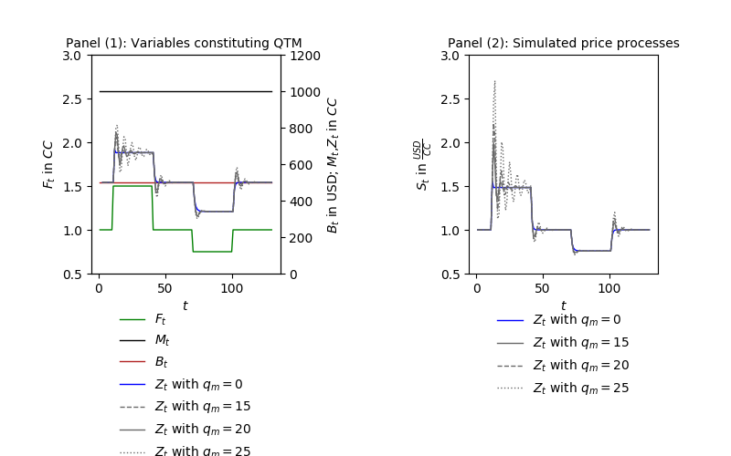

[](http://quantlet.de/)

## [](http://quantlet.de/) **csaamoe_2021_jump_up_and_down** [](http://quantlet.de/)

```yaml

Name of Quantlet: csaamoe_2021_jump_up_and_down

Published in: 'Cryptocurrency as Speculative Asset and Medium of Exchange (Pernice et al., 2021)'

Description: 'This Quantlet runs the price simulation Jumps described in the paper. Simulations are triggered with respect to shocks in the fundamental value. Additional simulations show the influence of the models parameters. To run this script, please clone the public repository from https://github.com/trudi-group/csaamoe_simulation_modules into the directory of this Quantlet.'

Keywords: 'price modelling, plotting, price shocks, simulation, cryptocurrency'

Author: Ingolf Pernice, Hermann Elendner, Anna Andresen

See also: other Quantlets in this project

Submitted: 02.09.2023

Datafile: Generic data

```

