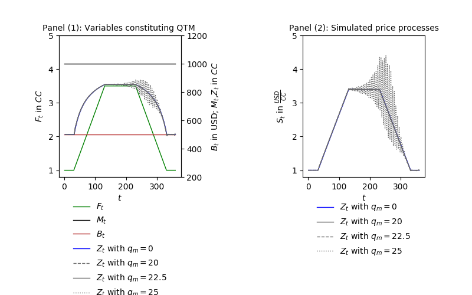

[](http://quantlet.de/)

## [](http://quantlet.de/) **csaamoe_2021_showoff_stabilization** [](http://quantlet.de/)

```yaml

Name of Quantlet: csaamoe_2021_showoff_stabilization

Published in: 'Cryptocurrency as Speculative Asset and Medium of Exchange (Pernice et al., 2021)'

Description: 'This Quantlet runs an interesting, additional simulation on stabilisation after shocks. Simulations are triggered with respect to shocks in the fundamental value. Additional simulations show the influence of the models parameters. To run this script, please clone the public repository from https://github.com/trudi-group/csaamoe_simulation_modules into the directory of this Quantlet.'

Keywords: 'price modelling, plotting, price shocks, simulation, cryptocurrency'

Author: Ingolf Pernice, Hermann Elendner, Anna Andresen

See also: other Quantlets in this project

Submitted: 02.09.2023

Datafile: Generic data

```



### PYTHON Code
```python

# -----------------------------------------------------------
# >>>>> General things >>>>> -------------------------------------
# -----------------------------------------------------------
# General modules
import numpy as np
import pandas as pd
import numpy as np
import yaml
import importlib
import sys
import os

path_settings = "./SETTINGS.yml"
path_gen_helpers = "./csaamoe_simulation_modules/gen_helpers.py"

# Change CWD
#os.chdir("/YOUR/DIRECTORY/csaamoe_2021/")

# Import settings
with open(path_settings, 'r') as stream:
    try:
        SETTINGS = yaml.safe_load(stream)
    except yaml.YAMLError as exc:
        print(exc)

# Import general helpers
spec = importlib.util.spec_from_file_location("noname", path_gen_helpers)
helpers = importlib.util.module_from_spec(spec)
spec.loader.exec_module(helpers)

# Import own modules
sys.path.append('./csaamoe_simulation_modules/')
import pricemodel

# -----------------------------------------------------------
# >>>>> Simulation                  >>>>> -------------------
# -----------------------------------------------------------
sim_params = {
    "memory_param_m": 40
    , "memory_param_v": 40
    , "amplitude_param_m": [0, 20, 22.5, 25]
    , "amplitude_param_v": 30
    , "m_total_baseline": 1000
    , "onchain_vol_usd_baseline": 500
    , "v_circ_baseline": 1
    , "fv_iter_start": 1
    , "prices_iter_start_1": 1
    , "prices_iter_start_2": 1
    , "n": 360
    , "level_shock_1": 0.025
    , "level_shock_2": 0.025
    , "n_shock_1_start": 30
    , "n_shock_1_end": 130
    , "n_shock_2_start": 230
    , "n_shock_2_end": 330
    , "ylim_prices_from": 0.8
    , "ylim_prices_to": 5
    , "ylim_modelvars_from": 200
    , "ylim_modelvars_to": 1200
    , "plot_rows": 1
    , "plot_cols": 2
    , "precision": 0.05
    , "fig_space_bottom": 0.40
    , "truncate_zH_until_period": False
}
pricemodel.make_simulation_increasing_fv(params=sim_params, fname="showoff_stabilization", path=SETTINGS["plotting"]["path"])

```

automatically created on 2023-09-17